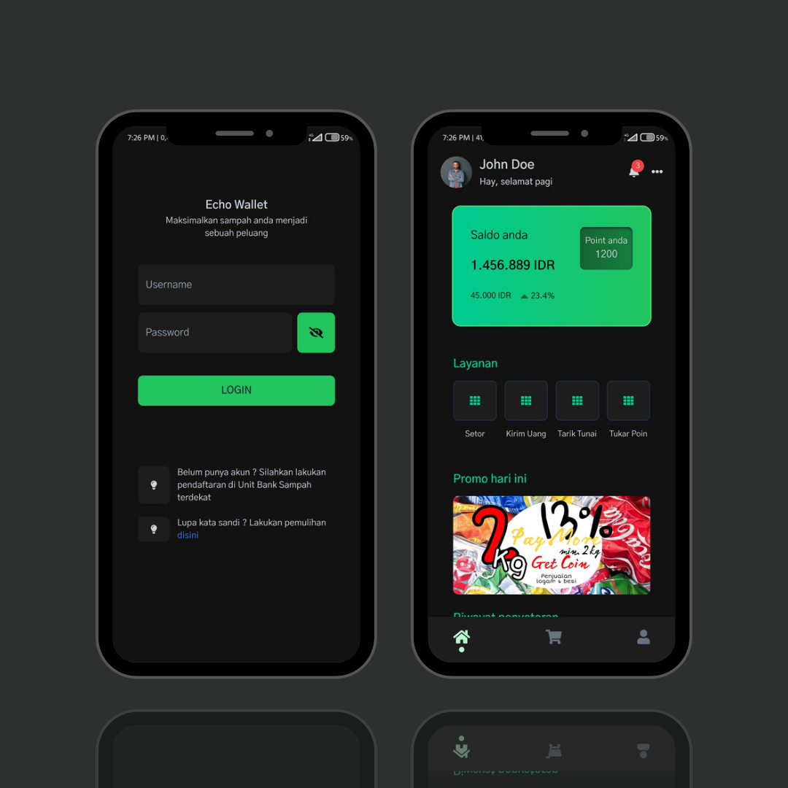

<h3 align="center">Echo Wallet</h3>

Platform Bank Sampah Digital - IO FTI Web Development Competition 2022

## Languages and Tools
- Vue JS 3
- Tailwind
- Splide JS
- Pinia
- Font Awesome 5
- Google Fonts Gothic A1
- Vite JS
- Git 
- Github
- Vercel
- Termux
- Neovim

### How to install
- <code>git clone https://github.com/or-abdillh/echo-wallet.git </code>
- <code>cd echo-wallet
- <code>npm install</code>
- <code>npm run dev</code>

### Demo 
- [Echo Wallet](http://echo-wallet.vercel.app)

### Thanks 
- Support me with a cup of coffee and other snacks [here ..](https://saweria.co/orabdillh)
- Don't forget to give me star in this repository 🙏🏻🙏🏻
- See my other projects on instagram [@or.abdillh](http://www.instagram.com/or.abdillh)

[Oka R Abdillah ](http://github.com/or-abdillh)
 
Last edited on : 22/04/2022
